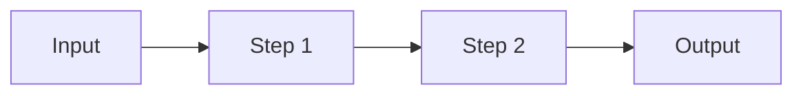

# PROJECT_NAME

> One-sentence pitch: what it does and for whom.


<!-- Add an eval-score badge once the nightly job publishes one. -->

<!-- DEMO: replace with a GIF (docs/demo.gif) or a live link. Keep it under 30 seconds. -->

## What it does (and doesn't)

- **Users:** who this is for.
- **Inputs:** what it accepts.
- **Outputs:** what it produces.
- **Out of scope:** what it deliberately does not do.
- **Data:** public / licensed / synthetic, and where it comes from.

## Results

Every claim below is backed by a reproducible run. Reports live in [`evals/reports/`](evals/reports/).

| Claim | Evidence | Result |
|-------|----------|--------|
| Meets task quality bar | Fast eval tier, N cases | _TBD_ |
| Improvement over baseline | Baseline vs. current on same cases | _TBD_ |
| Handles failures gracefully | Reproducible timeout/error cases | _TBD_ |
| Cost and latency | Measured per run, p50/p95 | _TBD_ |

## Architecture

<!-- Request-flow diagram (Mermaid or image): input -> steps -> output. Name each LLM call and tool. -->



## Quickstart

Requires Python 3.11+ and [uv](https://docs.astral.sh/uv/).

```bash
git clone https://github.com/OWNER/REPO && cd REPO
cp .env.example .env        # add your API key(s)
make install
make test
make eval-fast
```

## Evaluation

| Tier | When | Size | Command |
|------|------|------|---------|
| fast | every PR | ~10-15 cases | `make eval-fast` |
| standard | CI on main | ~50 cases | `make eval-standard` |
| nightly | scheduled | 100+ cases | `make eval-nightly` |

- Cases live in `evals/cases/` and change through PRs like code.
- Thresholds live in `evals/thresholds.yaml`; CI fails if they're missed.
- LLM-as-judge rubrics live in `evals/rubrics/` and are validated against a human-labeled gold set (see `evals/README.md`).

## Known failures and limitations

<!-- Real failures only. For each: the input, what went wrong, how you investigated, status. -->

_None documented yet. Add the first real one as soon as you see it._

## Security and cost notes

- Secrets are read from environment variables; nothing sensitive is committed.
- Untrusted inputs: describe how they're handled.
- Agent loops have step and cost caps (`src/app/config.py`).

## Design decisions

Short decision records live in [`docs/adr/`](docs/adr/).

## What's next

- One design decision I'd revisit:
- One unresolved limitation:
- Next planned test:
