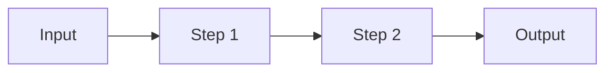

# PROJECT_NAME

> One-sentence pitch: what it does and for whom.


<!-- Add an eval-score badge once the nightly job publishes one. -->

<!-- DEMO: replace with a GIF (docs/demo.gif) or a live link. Keep it under 30 seconds. -->

## What it does (and doesn't)

- **Users:** who this is for.
- **Inputs:** what it accepts.
- **Outputs:** what it produces.
- **Out of scope:** what it deliberately does not do.
- **Data:** public / licensed / synthetic, and where it comes from.

## Results

Every claim below is backed by a reproducible run. Reports live in [`evals/reports/`](evals/reports/).

| Claim | Evidence | Result |
|-------|----------|--------|
| Meets task quality bar | Fast eval tier, N cases | _TBD_ |
| Improvement over baseline | Baseline vs. current on same cases | _TBD_ |
| Handles failures gracefully | Reproducible timeout/error cases | _TBD_ |
| Cost and latency | Measured per run, p50/p95 | _TBD_ |

## Architecture

<!-- Request-flow diagram (Mermaid or image): input -> steps -> output. Name each LLM call and tool. -->



Every LLM call is wrapped in `app.llm.complete` (or, for anything not yet wired to a real model,
still logged via `app.tracing.span` directly - see `app.pipeline.run`), tagged with its prompt
name and version, tokens, and cost. The whole `run()` call is metered by `app.llm.Budget` against
`Config.max_steps` / `max_cost_usd`; exceeding either raises `BudgetExceededError` rather than
truncating silently.

## Quickstart

Requires Python 3.11+ and [uv](https://docs.astral.sh/uv/).

```bash
git clone https://github.com/OWNER/REPO && cd REPO
cp .env.example .env        # add ANTHROPIC_API_KEY if you'll run anything live (see below)
make install
make test
make eval-fast               # mock mode, default - free, no key required
```

### Mock vs. live

Every entry point (`make eval-fast`, and any script you add) defaults to `APP_LLM_MODE=mock`:
`app.llm.get_client` returns `app.mock_llm.MockAnthropicClient` instead of the real Anthropic
client, so nothing hits the network and nothing costs money. The mock auto-generates schema-valid
responses from whatever `output_config.format.schema` a request passes - real enough in *shape* to
exercise routing, tracing, and budget accounting, but it has no real-world knowledge: its output
values are generic placeholders, not reasoned about. **A passing mock run is a plumbing signal,
not a quality signal.**

Only `make eval-fast-live` (or `APP_LLM_MODE=live`) calls the real API and costs real money. Run
it deliberately, not routinely - see Evaluation below.

## Evaluation

| Tier | When | Size | Cost | Command |
|------|------|------|------|---------|
| fast (mock) | every PR, routinely | ~10-15 cases | free | `make eval-fast` |
| fast (live) | deliberately, not routinely | ~10-15 cases | real API cost | `make eval-fast-live` |
| standard | CI on main | ~50 cases | real API cost | `make eval-standard` |
| nightly | scheduled | 100+ cases | real API cost | `make eval-nightly` |

- Cases live in `evals/cases/` and change through PRs like code. Cases the model itself proves
  unstable on across identical live runs move to `evals/cases/known-unstable/` instead of gating
  CI on a coin flip - see `evals/README.md` and that directory's own `README.md`.
- Thresholds live in `evals/thresholds.yaml`; CI fails if they're missed. They start as guesses -
  see that file's own comment - and should get tuned in their own dedicated commits once you have
  real measurements, not left at their starting values indefinitely.
- LLM-as-judge rubrics live in `evals/rubrics/` and are validated against a human-labeled gold set (see `evals/README.md`).
- `eval-standard` and `eval-nightly` don't yet have mock-forced/live-forced variants the way
  `eval-fast`/`eval-fast-live` do - they inherit whatever `APP_LLM_MODE` is set to (mock by
  default). Worth adding the same explicit split before either is used for real.

## Known failures and limitations

<!-- Real failures only. For each: the input, what went wrong, how you investigated, status. -->

_None documented yet. Add the first real one as soon as you see it._

## Security and cost notes

- Every entry point defaults to `APP_LLM_MODE=mock` (zero cost, no key required); only an explicit
  `live` override (or `make eval-fast-live`) spends real money - see Mock vs. live above.
- Secrets are read from environment variables; nothing sensitive is committed.
- Untrusted inputs: describe how they're handled.
- Agent loops have step and cost caps (`src/app/config.py`) - both are guesses until validated
  against a real live run, see `evals/thresholds.yaml`'s comment.
- `Config.max_cost_usd` bounds one agent run, not a whole eval run's total spend.
  `evals/thresholds.yaml`'s `max_total_cost_usd` bounds that instead. Neither replaces a real
  spend limit set on the API account itself - set one there too.

## Design decisions

Short decision records live in [`docs/adr/`](docs/adr/). Cross-project lessons - patterns worth
porting into this template, gaps found while building a real project from it - live in
[`docs/lessons-learned.md`](docs/lessons-learned.md); check it before starting a new project from
this template, and add to it when you find the next gap.

## What's next

- One design decision I'd revisit:
- One unresolved limitation:
- Next planned test:
